# Выполнение домашнего задания

1. Устанавливаю три виртуальные машины в VirtualBox

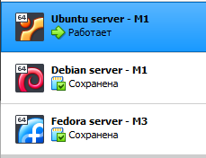

---

2. Далее произвожу переименование *hostname*

Для этого открываем нужный файл

```shell 
$ sudo vim /etc/hostname 
```

И переименовываем на нужный: ognevserver затем перезагружаем машину

---

3. Создаем нового пользователя ognev_1

```shell 
$ sudo adduser ognev_1 
```

```Full Name: Denis Ognev```

```Password: ####```

---

4. Проделываем тоже самое с другими линукс системами

**Debian**

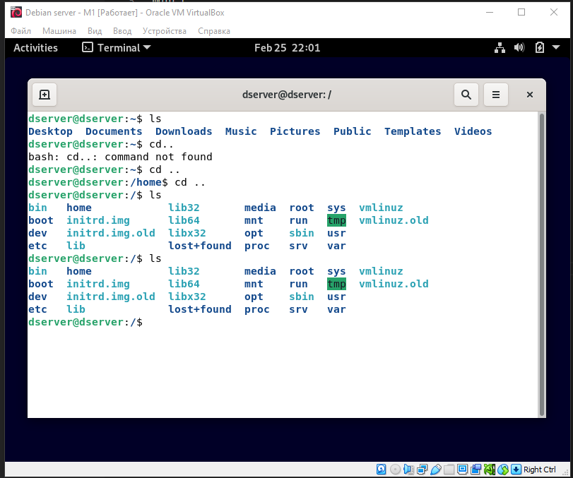

```shell 
$ sudo hostnamectl set-hostname ognev_gatevay 
$ sudo vim /etc/hosts 
```

Встречаю следующую ошибку


Пробую с root правами 

```shell
$ su
```

И получаю ещё  одну ошибку

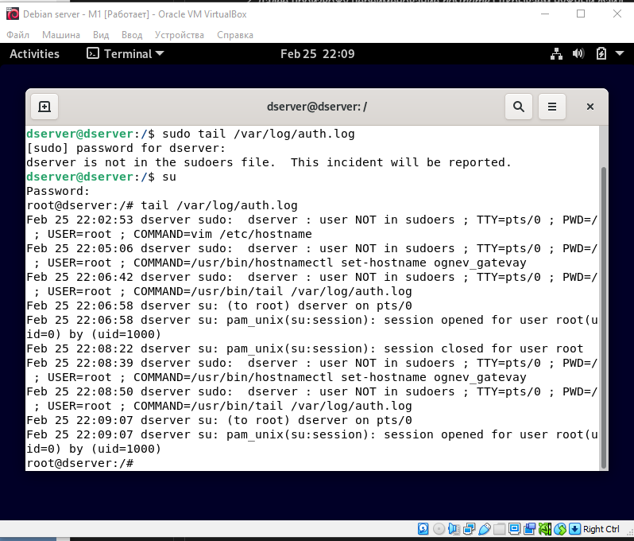

Выполняю следующие команды


---

5. Создаем нового пользователя ognev_1

```shell
$ sudo adduser ognev_2
 ```

```Full Name: Denis Ognev```

```Password: ####```


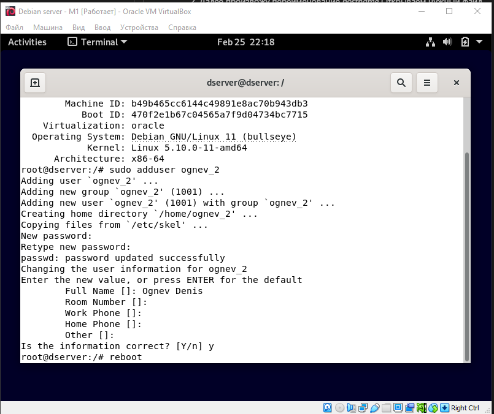

---

6. fedora

```shell
$ sudo hostnamectl set-hostname ognevclient 
$ sudo nano /etc/hostname 
$ sudo adduser ognev_3
$ sudo passwd ognev_3
Password: ####
```
Третий пользователь:

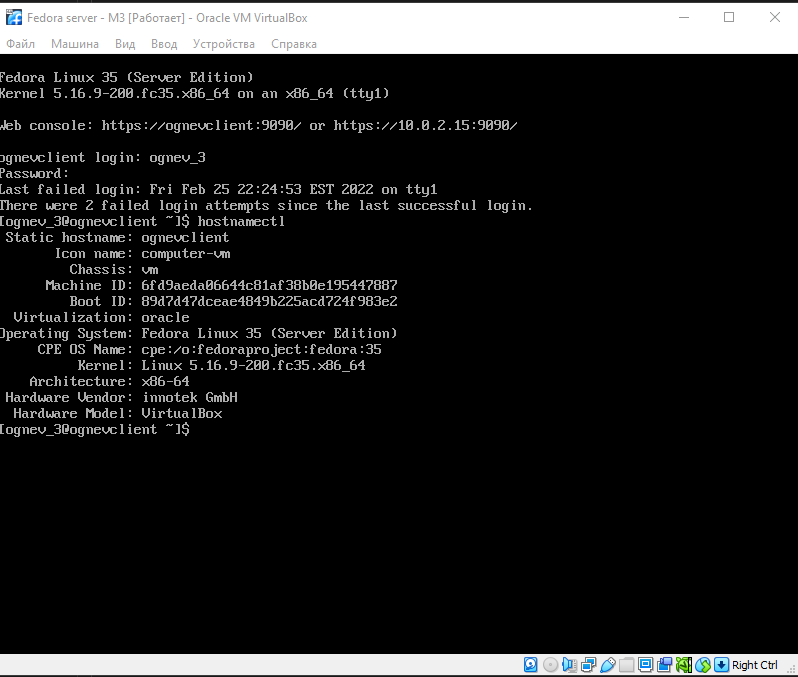

---

7. Настраиваем SSH соединение с машинами

Обновляем репозиторий командой:

```shell
$ sudo apt update
```

Устанавливаем SSH с помощью команды:

```shell
$ sudo apt-get install ssh
```

Устанавливаем OpenSSH

```shell
$ sudo apt install openssh-server
```

Добавим пакет SSH-сервера в автозагрузку


```shell
$ sudo systemctl enable sshd
$ apt install openssh-server -y
$ systemctl enable ssh
$ systemctl start ssh
$ system status ssh
```


Повторяем для других систем

**Debian**

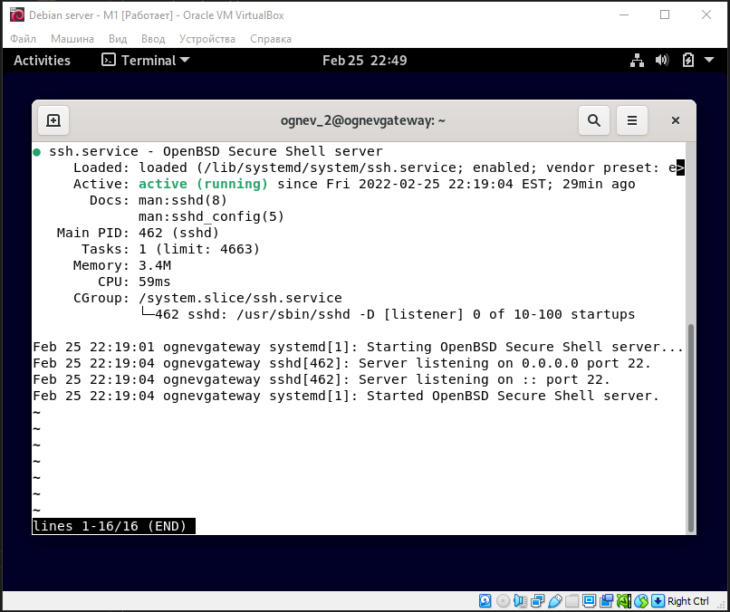

**Fedora**

```shell
$ sudo dnf install openssh-server
```

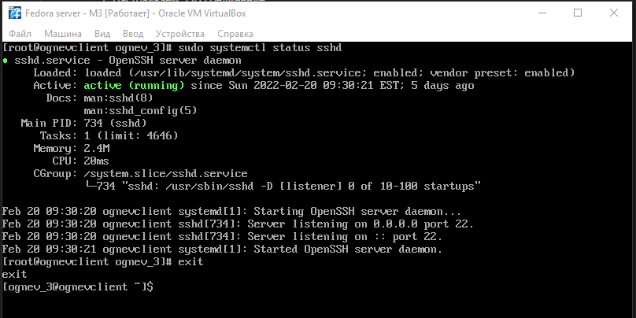

---

8. Выполним проброс портов для SSH, так как работаем с виртуальными машинами


Логин и порт:
- ```ognev_1 порт 20001```

- ```ognev_2 порт 20002```

- ```ognev_3 порт 20003```

---

9. Подключаемся по SSH 

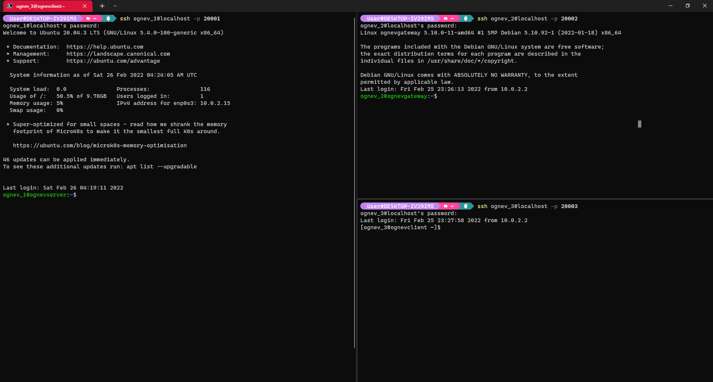

---

10. Настройка linux сети

**Ubuntu(Debian)**
```shell
$ sudo apt-get install netplan.io
```

**Fedora**
```shell
$ sudo dnf install snapd
```

---

Окей... У меня проблема...

... В виду того, что я ещё недостаточно разбираюсь в работе на разных линукс системах, то решил на этом этапе работать на 3-х ubuntu-server линукс дистрибутивах.

Создал пользователья, имя хоста и поднял ssh серверы на новых VM машинах


---

Конфигурируем в *netplan* сеть

**ognev_server**

Заполняем конфигурационный файл

```shell
$ sudo vim /etc/netplan/00-installer-config.yaml
```
```yaml
network:
  ethernets:
    enp0s3:
      dhcp4: true
    enp0s8:
      dhcp4: false
      addresses: [192.168.6.10/24]
      gateway4: 192.168.6.1
  version: 2
```
Проверяем синтаксис на корректность

```shell
$ sudo netplan --debug generate
```

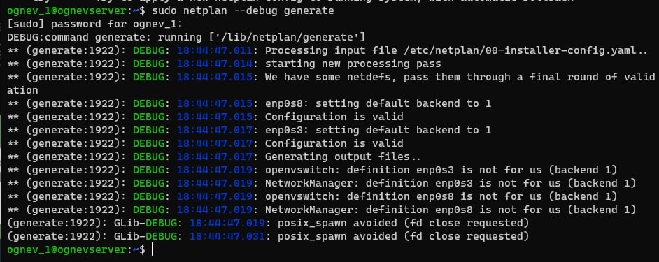

Применяем конфигурацию 

```shell
$ sudo netplan apple
```

**ognev_gateway**

Конфигурация сетевого шлюза

```yaml
network:
  ethernets:
    enp0s3:
      dhcp4: true
    enp0s8:
      dhcp4: false
      addresses: [192.168.6.1/24]
    enp0s9:
      dhcp4: false
      addresses: [192.168.7.1/24]
  version: 2
```

**ognev_client**

Конфигурация клиента

```yaml
network:
  ethernets:
    enp0s3:
      dhcp4: true
    enp0s8:
      dhcp4: false
      addresses: [192.168.6.10/24]
      gateway4: 192.168.6.1
  version: 2
```

Выведем содержимое плучившихся конфиг-файлов в консоль

```shell
$ cat /etc/netplan/00-installer-config.yaml
```


---

Выполним связывание интерфейсов enp0s8 и enp0s9 на шлюзе

```shell
$ sudo echo 1 | sudo tee /proc/sys/net/ipv4/ip_forward 1
```
Теперь Server и Client видят друг друга через шлюз

А чтобы при перезапуске машин шлюз восстанавливал видимость, раскомментируем данную строку

```#net.ipv4.ip_forward=1```

в файле 

```shell
$  sudo vim /etc/sysctl.conf 
```

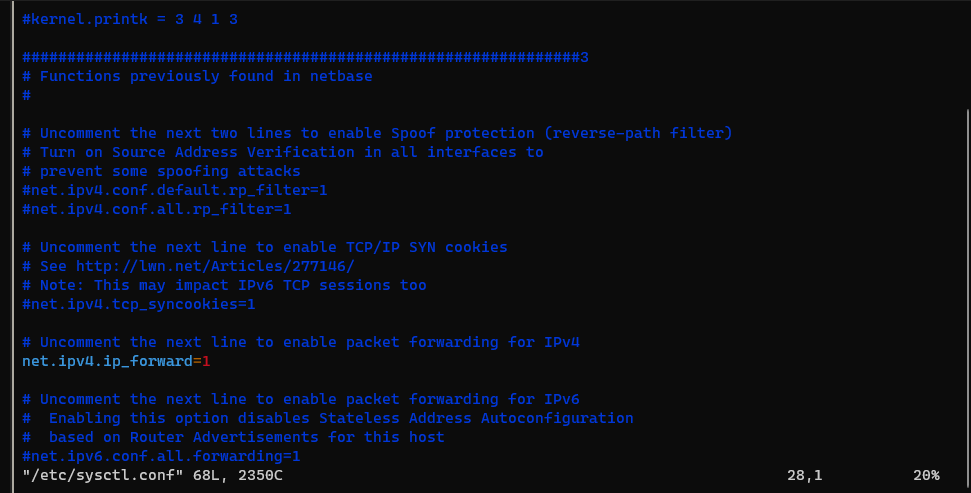

Получим в ```tcpdump``` следующий результат

```$ sudo tcpdump -i enp0s8 icmp```


Выполним фильтрацию пакетов с помощью ```iptables```


```shell
$ sudo iptables -A FORWARD -i enp0s9 -o enp0s8 -p tcp --syn --dport 5000 -m conntrack --ctstate NEW -j ACCEPT
$ sudo iptables -A FORWARD -i enp0s8 -o enp0s9 -m conntrack --ctstate ESTABLISHED,RELATED -j ACCEPT
$ sudo iptables -A FORWARD -i enp0s9 -o enp0s8 -m conntrack --ctstate ESTABLISHED,RELATED -j ACCEPT
$ sudo iptables -P FORWARD DROP
```
Поличился следующий набор правил


Сохраним правила

```shell
$ sudo apt-get install iptables-persistent
```


```shell
$ sudo su
root# sudo iptables-save > /etc/iptables/rules.v4
root# sudo ip6tables-save > /etc/iptables/rules.v6
root# exit
```

---

10. Создание HTTP-сервера

Копируем на ```ognev_server``` сервер

```shell
$ scp -P 20001 Server.py ognev_1@localhost:Server.py
```
Настраиваем службу ```web-server``` для автозапуска

```shell
$ sudo vim /lib/systemd/system/web-server.service
```

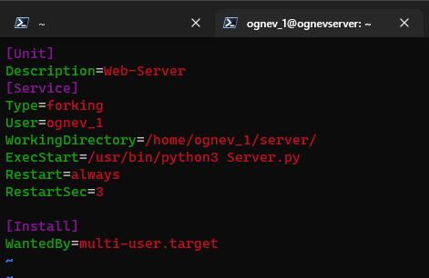


```
$ sudo systemctl daemon-reload
$ sudo systemctl start web-server
$ sudo systemctl status web-server
```


Выполним проверку работы Сервера командой ```curl```

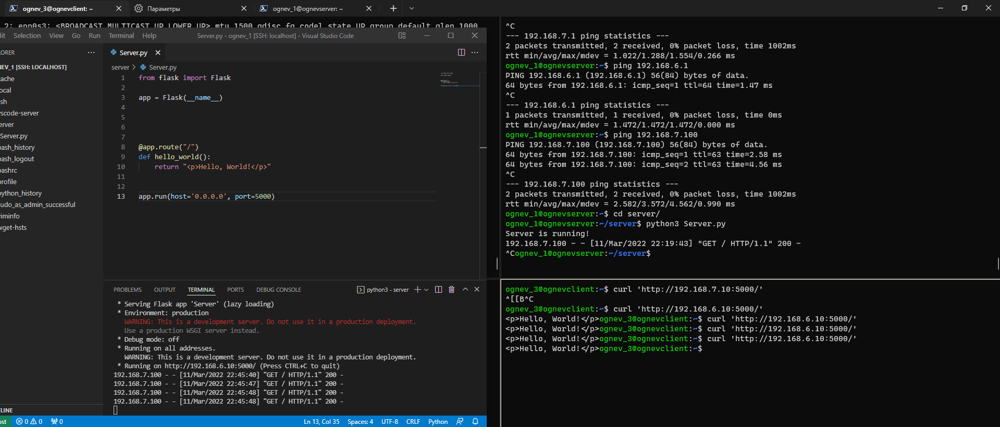

```shell
$ curl -X GET 192.168.6.10:5000/

$ curl -X POST -d 'username=linuxize' http://192.168.6.10:5000/login

$ curl -X PUT -d password=0000 192.168.6.10:5000/change_password
```

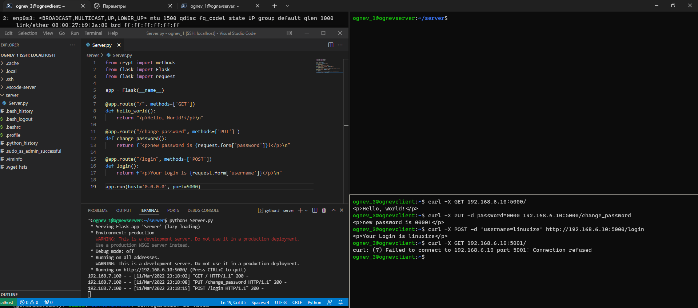

Посмотрим на *tcpdump*

```shell
$ sudo tcpdump -i enp0s8 tcp
```

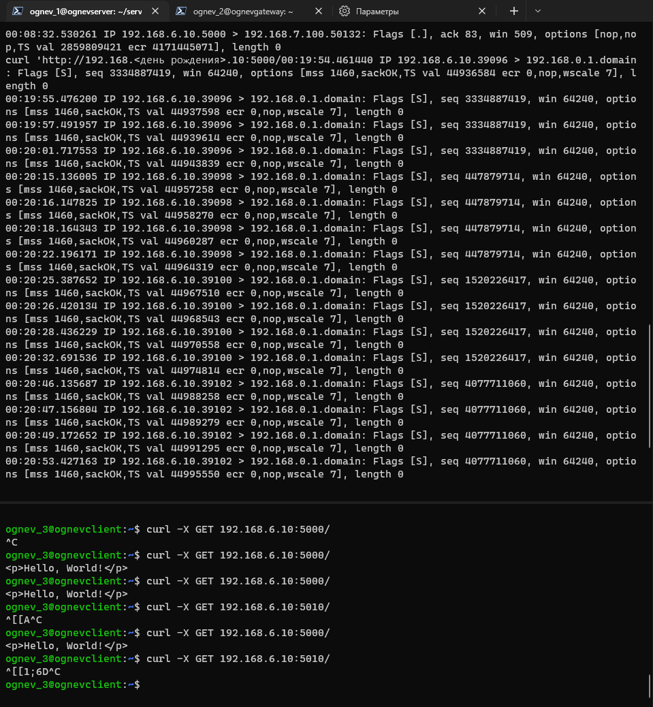

---

# Заключение

Таким образом, была выполнена работа по натройке сетевого соединения между устройствами, конфигурирования сети, разворачиванию простенького HTTP-сервера, с методами GET, POST, PUT. 